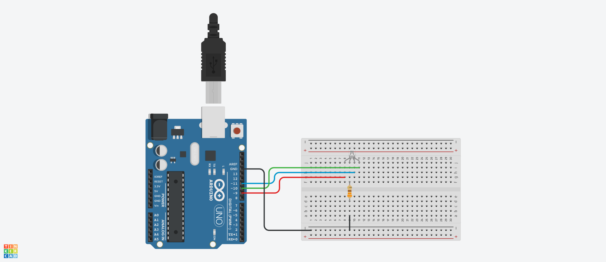
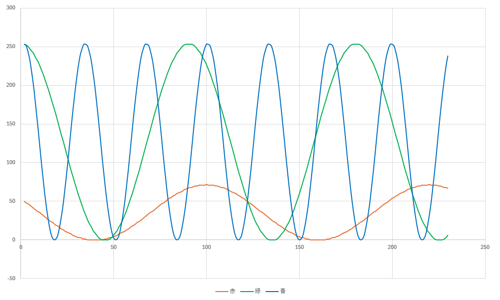
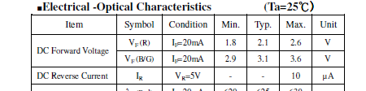

# ColorLedOSTA5131A Class 定義
## Ⅰ.概要
### Ⅰ-ⅰ クラスパラメータ

|Parameter |Value |Note |
|:---|---:|:---|
|namespace |ElectronicComponent |電子部品共通名前空間を使用する |
|template-spec |n/a |テンプレートの指定なし |
|ms-decl-spec |n/a |ストレージ クラスの指定なし |
|tag |ColorLedOSTA5131A | |
|base |n/a |基本クラスの指定なし |

### Ⅰ-ⅱ 処理概要
Arduino 向けフルカラー LED OSTA5131A 用クラス定義  
1. 赤、緑および青色をそれぞれ単色で点灯できる
2. 赤、緑および青色の輝度を指定し PWM 出力で点灯できる
3. すべての色を消灯できる
4. 点灯状態を保持し、取得できる
5. 赤、緑および青色の輝度を保持し、取得できる

## Ⅱ.メンバ定義
### Ⅱ-ⅰ.定数
|No |ID |Access |Type |Value |Abstruct |
|:---:|:---|:---|:---:|---:|:---|
|1 |COLOR_LED_OSTA5131A_HIGH |Private |int |0xff |最大アナログ値 |
|2 |COLOR_LED_OSTA5131A_LOW |Private |int |0x00 |最小アナログ値 |

### Ⅱ-ⅱ.変数
|No |ID |Access |Type |Abstruct |
|:---:|:---|:---|:---:|:---|
|1 |pinRed |Private |unsigned int |4番アノードピン(赤色)番号 | 
|2 |pinGreen |Private |unsigned int |1番アノードピン(緑色)番号 | 
|3 |pinBlue |Private |unsigned int |2番アノードピン(青色)番号 | 
|4 |brightnessRed |Private |int |赤色輝度 | 
|5 |brightnessGreen |Private |int |緑色輝度 | 
|6 |brightnessBule |Private |int |青色輝度 | 
|7 |isLight |Private |bool |点灯状態 | 

### Ⅱ-ⅲ.メソッド
|No |ID |Access |Return Type |Abstract |
|:---:|:---|:---|:---:|:---|
|1 |ColorLedOSTA5131A |Public |void |コンストラクタ |
|2 |lightLed |Public |void |RGB の輝度を指定して点灯する |
|3 |lightRed |Public |void |赤色を点灯する |
|4 |lightGreen |Public |void |緑色を点灯する |
|5 |lightBlue |Public |void |青色を点灯する |
|6 |turnOff |Public |void |全色消灯する |
|7 |isLighting |Public |bool |点灯状態を取得 |
|8 |getPinRed |Public |unsigned int |4番アノードピン番号を取得 |
|9 |getPinGreen |Public |unsigned int |1番アノードピン番号を取得 |
|10 |getPinBlue |Public |unsigned int |2番アノードピン番号を取得 |
|11 |getBrightnessRed |Public |int |4番アノードピンへの現在の出力輝度を取得 |
|12 |getBrightnessGreen |Public |int |1番アノードピンへの現在の出力輝度を取得 |
|13 |getBrightnessBlue |Public |int |2番アノードピンへの現在の出力輝度を取得 |

> [!NOTE]
> デストラクタなし  

#### Ⅱ-ⅲ-1.ColorLedOSTA5131A()
1. 引数

|No |ID |Type |Value |Optional |Abstract |
|:---:|:---|:---:|---:|:---:|:---|
|1 |redPin |int |- |false |4 番アノード(赤)対向ピン番号 |
|2 |greenPin |int |- |false |1 番アノード(緑)対向ピン番号 |
|3 |bluePin |int |- |false |2 番アノード(青)対向ピン番号 |

2. 処理概要

* メンバ 輝度(赤) の値を 0x00 にする
* メンバ 輝度(緑) の値を 0x00 にする
* メンバ 輝度(青) の値を 0x00 にする
* 4 番アノード(赤)対向ピンの値に引数 redPin の値を設定する
* 1 番アノード(緑)対向ピンの値に引数 greenPin の値を設定する
* 2 番アノード(青)対向ピンの値に引数 bulePin の値を設定する
* 点灯状態を false にする

#### Ⅱ-ⅲ-2.lightLed()
1. 引数

|No |ID |Type |Value |Optional |Abstract |
|:---:|:---|:---:|---:|:---:|:---|
|1 |red |int |- |false |輝度(赤) |
|2 |green |int |- |false |輝度(緑) |
|3 |blue |int |- |false |輝度(青) |

2. 処理概要

* メンバ 輝度(赤) の値に引数 red の値を設定する
* メンバ 輝度(緑) の値に引数 green の値を設定する
* メンバ 輝度(青) の値に引数 blue の値を設定する
* 4 番アノード(赤)対向ピンへの出力をメンバ 輝度(赤)にする
* 1 番アノード(緑)対向ピンへの出力をメンバ 輝度(緑)にする
* 2 番アノード(青)対向ピンへの出力をメンバ 輝度(青)にする
* 点灯状態を true にする

#### Ⅱ-ⅲ-3.lightRed()
1. 引数

なし  

2. 処理概要

* 4 番アノード(赤)対向ピンへの出力を HIGH にする
* 点灯状態を true にする

#### Ⅱ-ⅲ-4.lightGreen()
1. 引数

なし  

2. 処理概要

* 1 番アノード(緑)対向ピンへの出力を HIGH にする
* 点灯状態を true にする

#### Ⅱ-ⅲ-5.lightBlue()
1. 引数

なし  

2. 処理概要

* 2 番アノード(青)対向ピンへの出力を HIGH にする
* 点灯状態を true にする

#### Ⅱ-ⅲ-6.turnOff()
1. 引数

なし  

2. 処理概要

* すべてのピンへの出力を LOW にする
* 点灯状態を false にする

#### Ⅱ-ⅲ-7.isLighting()
1. 引数

なし  

2. 処理概要

* メンバ 点灯状態 の値を返す

#### Ⅱ-ⅲ-8.getPinRed()
1. 引数

なし  

2. 処理概要

* メンバ 4 番アノード(赤)対向ピン番号 の値を返す

#### Ⅱ-ⅲ-9.getPinGreen()
1. 引数

なし  

2. 処理概要

* メンバ 1 番アノード(緑)対向ピン番号 の値を返す

#### Ⅱ-ⅲ-10.getPinBlue()
1. 引数

なし  

2. 処理概要

* メンバ 2 番アノード(青)対向ピン番号 の値を返す

#### Ⅱ-ⅲ-11.getBrightnessRed()
1. 引数

なし  

2. 処理概要

* メンバ 輝度(赤) の値を返す

#### Ⅱ-ⅲ-12.getBrightnessGreen()
1. 引数

なし  

2. 処理概要

* メンバ 輝度(緑) の値を返す

#### Ⅱ-ⅲ-13.getBrightnessBlue()
1. 引数

なし  

2. 処理概要

* メンバ 輝度(青) の値を返す

## Ⅲ.特記事項
### Ⅲ-ⅰ.利用上の注意
このクラスは Arduino での利用を想定しているため、他のマイコンボードでの動作は保証しない  

### Ⅲ-ⅱ.利用方法
#### Ⅲ-ⅱ-1.初期化
クラスインスタンスを生成する。4 番アノード、1 番アノードおよび 2 番アノードの対向ピン番号を指定すること

```
ColorLedOSTA5131A* myLed;
myLed = new ColorLedOSTA5131A( 9, 10, 11 );
```

#### Ⅲ-ⅱ.2.単色点灯
lightRed()、lightGreen() または lightBule() をコールすることで赤、緑もしくは青を点灯する

> [!NOTE]
> 指定した色の輝度は最大値 0xff となり、指定外の色の輝度は最小値 0x00 となる

#### Ⅲ-ⅱ.3.輝度指定点灯
lightLed() をコールして赤、緑および青の輝度を指定して点灯させることができる

```
lightLed( 127, 127, 127 );

// 各色の輝度について範囲外の値が指定された場合は更新されない
lightLed( -127, 127, 127 );

// 全色の輝度が範囲外の場合、状態は変わらない
lightLed( -127, -127, 512 );
```

> [!WARNING]
> 範囲外の値を指定してもエラーとはならない。コールされる前の輝度がそのまま維持される  
> 点灯状態についてもそのまま維持される 

#### Ⅲ-ⅱ.4.消灯
turnOff() をコールすると全色消灯する

### Ⅲ-ⅲ.サンプルスケッチについて
サンプルスケッチ ColorLedOSTA5131A.ino はカソードに抵抗を入れる前提としている。配線例は fig3-1 参照  


**fig3-1 配線例**

最初に赤色→緑色→青色を 2 秒ずつ発光し、2 秒消灯してから輝度指定するように動作する。指定値について fig3-2 のグラフを参照

  
**fig3-2 サンプルスケッチの各色の輝度推移**

> [!IMPORTANT]
> 赤色 LED の V<sub>F</sub> は緑色、青色の V<sub>F</sub> と値が異なる(fig3-3 参照)ため輝度指定出力する値を調整している

  
**fig3-3 入力電圧(データシートより抜粋)**
