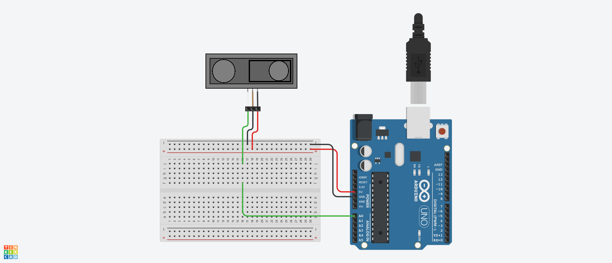

# InfraredSensorGP2Y0A21YK Class 定義
## Ⅰ.概要
### Ⅰ-ⅰ クラスパラメータ

|Parameter |Value |Note |
|:---|---:|:---|
|namespace |ElectronicComponent |電子部品共通名前空間を使用する |
|template-spec |n/a |テンプレートの指定なし |
|ms-decl-spec |n/a |ストレージ クラスの指定なし |
|tag |InfraredSensorGP2Y0A21YK | |
|base |n/a |基本クラスの指定なし |

### Ⅰ-ⅱ 処理概要
Arduino 向け赤外線測距センサ GP2Y0A21YK 用クラス定義
1. ADC による入力値から入力電圧を算出する
2. ADC による入力値から距離を算出する
3. 測定した値を取得できる

> [!WARNING]
> 測距有効範囲は 10(cm) から 80(cm) までとなる(データシートの記載による)

## Ⅱ.メンバ定義
### Ⅱ-ⅰ.定数
|No |ID |Access |Type |Value |Abstruct |
|:---:|:---|:---|:---:|---:|:---|
|1 |RANGE_DATA_CONVERSION |private |float |26.488F |測距データ換算用係数 |
|2 |ORDER_DATA_CONVERSION |private |float |-1.209F |測距データ換算用次数 |
|3 |ADC_RESOLUTION |private |float |1024.0F |ADC 分解能 |
|4 |REFERENCE_VOLTAGE |private |float |5.0F |基準電圧 |

> [!IMPORTANT]
> 係数および次数は実測値から算出しているため、機材によっては変更する必要が生じる場合がある点に注意 

### Ⅱ-ⅱ.変数
|No |ID |Access |Type |Abstruct |
|:---:|:---|:---|:---:|:---|
|1 |inputPinNo |private |unsgined int |アナログ入力ピン | 
|2 |rangingDistance |private |float |測距距離(cm) | 
|3 |analogInputVoltage |private |float |アナログ入力電圧(換算値) | 
|4 |analogDigitalConvValue |private |int |アナログデジタル変換値 | 

### Ⅱ-ⅲ.メソッド
|No |ID |Access |Return Type |Abstract |
|:---:|:---|:---|:---:|:---|
|1 |InfraredSensorGP2Y0A21YK |public |void |コンストラクタ |
|2 |acquireMeasurementData |public |float |測距データ取得 |
|3 |acquireMeasuredVoltage |public |float |計測電圧取得 |
|4 |acquireADCValue |public |int |ADC値取得 |
|5 |analogInputValueMeasurement |private |void |アナログ入力値計測 |
|6 |distanceConversion |private |void |距離換算処理 |

> [!NOTE]
> デストラクタなし  

#### Ⅱ-ⅲ-1.InfraredSensorGP2Y0A21YK()
1. 引数

|No |ID |Type |Value |Optional |Abstract |
|:---:|:---|:---:|---:|:---:|:---|
|1 |inputPin |unsigned int |- |false |アナログ入力ピン番号 |

2. 処理概要

* コンストラクタとして呼ばれ、以下のメンバを初期化する

|ID |Value |Note |
|:---|---:|:---|
|inputPinNo |inputPin | | 
|rangingDistance |0.0F | | 
|analogInputVoltage |0.0F | | 
|analogDigitalConvValue |0 | | 

#### Ⅱ-ⅲ-2.acquireMeasurementData()
1. 引数  
なし

2. 処理概要
* analogInputValueMeasurement() をコールして計測値を取得する
* メンバ 測距距離 の値を返す

#### Ⅱ-ⅲ-3.acquireMeasuredVoltage()
1. 引数  
なし

2. 処理概要
* analogInputValueMeasurement() をコールして計測値を取得する
* メンバ アナログ入力電圧 の値を返す

#### Ⅱ-ⅲ-4.acquireADCValue()
1. 引数  
なし

2. 処理概要
* analogInputValueMeasurement() をコールして計測値を取得する
* メンバ アナログデジタル変換値 の値を返す

#### Ⅱ-ⅲ-5.analogInputValueMeasurement()
1. 引数  
なし

2. 処理概要

* アナログ入力ピンからメンバ アナログデジタル変換値 の値を取得する
* メンバ アナログデジタル変換値 ($ADC$) から換算電圧 ($V$) を以下式で算出してメンバ アナログ入力電圧 に格納する  
$V = \left( \frac{ADC}{1024} \cdot V_{ref} \right)$
* distanceConversion() メソッドをコールしてメンバ 測距距離 に格納する

#### Ⅱ-ⅲ-6.distanceConversion()
1. 引数  
なし

2. 処理概要

* メンバ アナログ入力電圧 ($V$) の値から以下の式で距離 ($D$) を算出して返す  
$D = 26.488V^{-1.209}$

> [!IMPORTANT]
> 上記の式は実測値から取得しているため、機材によっては変更する必要が生じる場合がある点に注意 

## Ⅲ.特記事項
このクラスは Arduino での利用を想定しているため、他のマイコンボードでの動作は保証しない

### Ⅲ-ⅱ.利用方法
#### Ⅲ-ⅱ-1.初期化
1. setup() 内でクラスインスタンスを生成する。アナログ入力ピン番号を指定すること

```
InfraredSensorGP2Y0A21YK* myIfSensor;
myIfSensor = new InfraredSensorGP2Y0A21YK( A0 );
```

#### Ⅲ-ⅱ-2.計測して値を取得
1. 測距距離を取得する場合、acquireMeasurementData() をコールする

```
float distance = myIfSensor->acquireMeasurementData();
```

2. 換算電圧を取得する場合、acquireMeasuredVoltage() をコールする

```
float voltage = myIfSensor->acquireMeasuredVoltage();
```

3. ADC 値を取得する場合、acquireADCValue() をコールする

```
int adcValue = myIfSensor->acquireADCValue();
```

### Ⅲ-ⅲ.サンプルスケッチ
  
**fig3-1 サンプルスケッチ動作用回路**

サンプルスケッチは fig3-1 のように回路を作成すること  
10 秒ごとに距離計測を実施し、シリアル通信で PC へ送信する
PC 側のシリアルモニタに計測時間(経過ミリ秒)と計測値(ADC 値、換算電圧および測距距離)を表示する(以下例参照)

```
Ready...
4291 :: ADC - 1001, Voltage - 2.50V, Distance - 1.23cm
```
