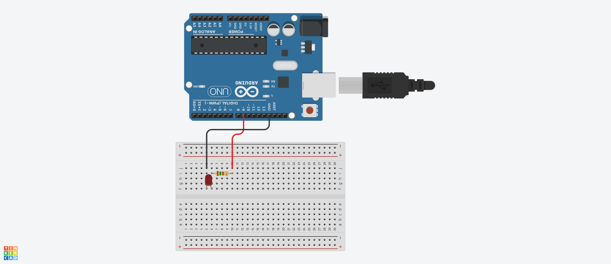

# LedOSR5JA5E34B Class 定義
## Ⅰ.概要
### Ⅰ-ⅰ クラスパラメータ

|Parameter |Value |Note |
|:---|---:|:---|
|namespace |ElectronicComponent |電子部品共通名前空間を使用する |
|template-spec |n/a |テンプレートの指定なし |
|ms-decl-spec |n/a |ストレージ クラスの指定なし |
|tag |LedOSR5JA5E34B | |
|base |n/a |基本クラスの指定なし |

### Ⅰ-ⅱ 処理概要
Arduino 向け LED OSR5JA5E34B 用クラス定義  
1. 赤単色で点灯できる
2. 赤色の輝度を指定し PWM 出力で点灯できる
3. 消灯できる
4. 点灯状態を保持し、取得できる
5. 赤色の輝度を保持し、取得できる

## Ⅱ.メンバ定義
### Ⅱ-ⅰ.定数
|No |ID |Access |Type |Value |Abstruct |
|:---:|:---|:---|:---:|---:|:---|
|1 |LED_OSR5JA5E34B_HIGH |private |int |0xff |輝度最大値 |
|2 |LED_OSR5JA5E34B_LOW |private |int |0x00 |輝度最小値 |

### Ⅱ-ⅱ.変数
|No |ID |Access |Type |Abstruct |
|:---:|:---|:---|:---:|:---|
|1 |pin |private |unsigned int |アノード対向ピン番号 | 
|2 |brightness |private |int |輝度 | 
|3 |isLight |private |bool |点灯状態 | 

### Ⅱ-ⅲ.メソッド
|No |ID |Access |Return Type |Abstract |
|:---:|:---|:---|:---:|:---|
|1 |LedOSR5JA5E34B |Public |void |コンストラクタ |
|2 |lightLEDFull |Public |void |点灯 |
|3 |lightLED |Public |void |輝度指定点灯 |
|4 |turnOff |Public |void |消灯 |
|5 |isLighting |Public |bool |点灯状態取得 |
|6 |getPin |Public |unsigned int |ゲッタ(ピン) |
|7 |getBrightness |Public |int |ゲッタ(輝度) |

#### Ⅱ-ⅳ-1.LedOSR5JA5E34B()
1. 引数

|No |ID |Type |Value |Optional |Abstract |
|:---:|:---|:---:|---:|:---:|:---|
|1 |pinNo |unsigned int |- |False |対向ピン番号 |

2. 処理概要
* メンバ 輝度 の値を 0x00 にする
* 対向ピンの値に引数 pinNo の値を設定する
* 点灯状態を false にする

> [!NOTE]
> デストラクタなし  

#### Ⅱ-ⅳ-2.lightLEDFull()
1. 引数  
なし  

2. 処理概要
* 対向ピンへの出力を HIGH にする
* 点灯状態を true にする

#### Ⅱ-ⅳ-3.lightLED()
1. 引数

|No |ID |Type |Value |Optional |Abstract |
|:---:|:---|:---:|---:|:---:|:---|
|1 |brightness |int |- |False |輝度 |

2. 処理概要
* メンバ 輝度 の値に引数 brightness の値を設定する
* 対向ピンへの出力をメンバ輝度にする
* 点灯状態を true にする

#### Ⅱ-ⅳ-4.turnOff()
1. 引数  
なし  

2. 処理概要
* 対向ピンへの出力を LOW にする
* 点灯状態を false にする

#### Ⅱ-ⅳ-5.isLighting()
1. 引数  
なし  

2. 処理概要
* メンバ 点灯状態 の値を返す

#### Ⅱ-ⅳ-6.getPin()
1. 引数  
なし  

2. 処理概要
* メンバ 対向ピン番号 の値を返す

#### Ⅱ-ⅳ-7.getBrightness()
1. 引数  
なし  

2. 処理概要
* メンバ 輝度 の値を返す
  
## Ⅲ.特記事項
### Ⅲ-ⅰ.利用上の注意
このクラスは Arduino での利用を想定しているため、他のマイコンボードでの動作は保証しない  

### Ⅲ-ⅱ.利用方法
#### Ⅲ-ⅱ-1.初期化
クラスインスタンスを生成する。アノードの対向ピン番号を指定すること

```
LedOSR5JA5E34B* myLed;
myLed = new LedOSR5JA5E34B( 9 );
```

#### Ⅲ-ⅱ.2.単色点灯
lightLEDFull() をコールすることで点灯する

#### Ⅲ-ⅱ.3.輝度指定点灯
lightLed() をコールして輝度を指定して点灯させることができる

```
lightLED( 127 );

// 0x00 ～ 0xff の範囲外の値が指定された場合、輝度は変更されない
lightLED( -127 );
lightLED( 512 );
```

> [!WARNING]
> 範囲外の値を指定してもエラーとはならない。コールされる前の輝度がそのまま維持される  
> 点灯状態もそのまま維持される 

#### Ⅲ-ⅱ.4.消灯
turnOff() をコールすると消灯する

### Ⅲ-ⅲ.サンプルスケッチについて
サンプルスケッチ LedOSR5JA5E34B.ino の配線例は fig3-1 参照  


**fig3-1 配線例**

最初に赤色を 2 秒発光し、2 秒消灯してから輝度指定するように動作する。
