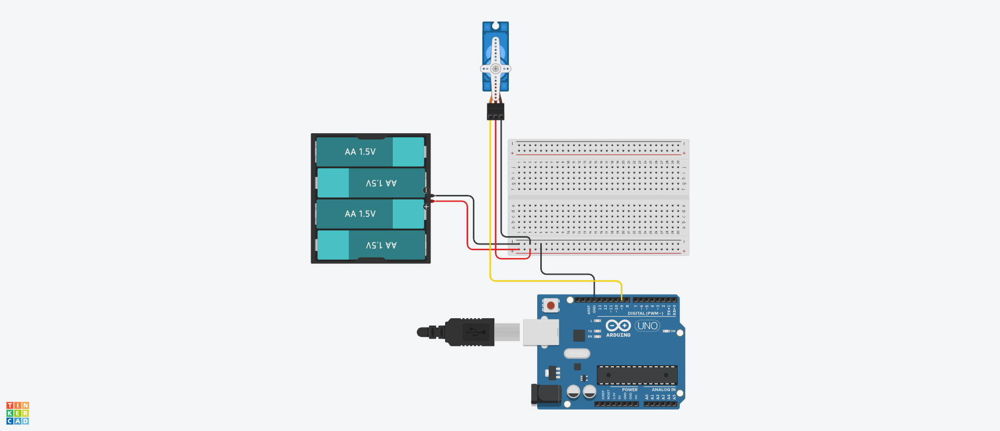

# MicroServoMG90S Class 定義
## Ⅰ.概要
### Ⅰ-ⅰ クラスパラメータ

|Parameter |Value |Note |
|:---|---:|:---|
|namespace |ElectronicComponent |電子部品共通名前空間を使用する |
|template-spec |n/a |テンプレートの指定なし |
|ms-decl-spec |n/a |ストレージ クラスの指定なし |
|tag |MicroServoMG90S | |
|base |n/a |基本クラスの指定なし |

### Ⅰ-ⅱ 処理概要
Arduino 向けサーボモータ MG90S 用クラス定義 

1. サーボモータ角度指定して回転させられる

## Ⅱ.メンバ定義
### Ⅱ-ⅰ.列挙定数
1. anglePosition

|No |ID |Access |Type |Value |Abstruct |
|:---:|:---|:---|:---:|---:|:---|
|1 |ANGLE_CENTER_POSITION |public |int |90 |角度指定(中央位置) |
|2 |ANGLE_START_POSITION |public |int |0 |角度指定(端位置) |
|3 |ANGLE_END_POSITION |public |int |180 |角度指定(端位置) |

### Ⅱ-ⅱ.変数
|No |ID |Access |Type |Abstruct |
|:---:|:---|:---|:---:|:---|
|1 |clServo |private |Servo* |サーボモータクラスへのインスタンス | 
|2 |pinNo |private |unsigned int |制御ピン番号 | 
|3 |degree |private |int |指定角度 | 

### Ⅱ-ⅲ.メソッド
|No |ID |Access |Return Type |Abstract |
|:---:|:---|:---|:---:|:---|
|1 |MicroServoMG90S |public |void |コンストラクタ |
|2 |adjustDegree |public |void |角度指定 |
|3 |getPinNo |public |unsigned int |getter(制御ピン番号) |
|4 |getDegree |public |int |getter(指定角度) |

> [!NOTE]
> デストラクタなし  

#### Ⅱ-ⅲ-1.MicroServoMG90S()
1. 引数

|No |ID |Type |Value |Optional |Abstract |
|:---:|:---|:---:|---:|:---:|:---|
|1 |pinNo |unsigned int |- |false |制御ピン番号 |

2. 処理概要

* pinNo でメンバ制御ピン番号を初期化する
* メンバサーボモータクラスへのインスタンスを設定する

#### Ⅱ-ⅲ-2.adjustDegree()
1. 引数

|No |ID |Type |Value |Optional |Abstract |
|:---:|:---|:---:|---:|:---:|:---|
|1 |degree |int |- |false |指定角度 |

2. 処理概要

* 引数とメンバ指定角度が同じ場合何もしない
* 引数の範囲が ANGLE_START_POSITION から ANGLE_END_POSITION の間である場合、メンバ指定角度の値を更新する。範囲外の場合何もしない
* メンバ指定角度でモータを動作させる

#### Ⅱ-ⅲ-3.getPinNo()
1. 引数  
なし

2. 処理概要

* メンバ制御ピン番号の値を返す

#### Ⅱ-ⅲ-4.getDegree()
1. 引数  
なし

2. 処理概要

* メンバ指定角度の値を返す

## Ⅲ.特記事項
### Ⅲ-ⅰ.利用上の注意
1. このクラスは Arduino での利用を想定しているため、他のマイコンボードでの動作は保証しない
2. このクラスでは Servo ライブラリの利用を前提としているため、事前にインストールしておくこと

### Ⅲ-ⅱ.利用方法
### Ⅲ-ⅱ-1.初期化
制御ピン番号を指定してインスタンス生成すること

```
MicroServoMG90S* myServo;
myServo = new MicroServoMG90S( 9U );
```

### Ⅲ-ⅱ-2.角度指定動作
adjustDegree() に角度を指定すると指定角度で動作する

```
myServo->adjustDegree( 135 );
// 範囲外の場合動かない
myServo->adjustDegree( -45 );
myServo->adjustDegree( 270 );
```

### Ⅲ-ⅲ.サンプルスケッチ
サンプルスケッチ用の配線は fig3-1 を参照

  
**fig3-1 サンプルスケッチ動作用回路**  

1. 0 度にアジャストされて 2 秒停止する
2. 10 ミリ秒ごとに 1 度ずつ移動し、0 度もしくは 180 度まで達したら移動方向が反転する
