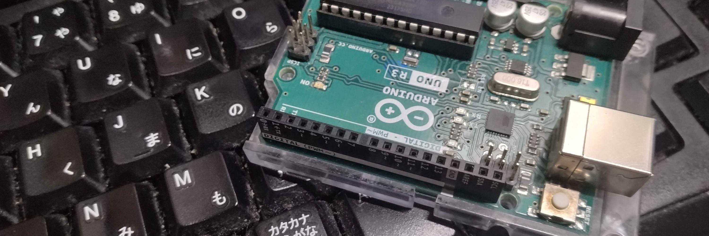

# Arduino Samples
## 概要
  
電子部品を Arduino Uno で利用するためのクラスモジュールとサンプルスケッチが含まれています。
このリポジトリには以下の部品用のクラスモジュールが含まれます。

1. [赤色 LED](LedOSR5JA5E34B/LedOSR5JA5E34B.md)
2. [フルカラー LED](ColorLedOSTA5131A/ColorLedOSTA5131A.md)
3. [7 セグメント LED](Red7SegmentLedC551SRD/Red7SegmentLedC551SRD.md)
4. [シフトレジスタ](ShiftRegister74HC595/ShiftRegister74HC595.md)
5. [タクトスイッチ](TactSwitchDTS6V/TactSwitchDTS6V.md)
6. [半固定抵抗器](SemiFixedResistorTSR3386T/SemiFixedResistorTSR3386T.md)
7. [LCD](GroveLcdRgbBacklight/GroveLcdRgbBacklight.md)
8. [赤外線測距モジュール](InfraredSensorGP2Y0A21YK/InfraredSensorGP2Y0A21YK.md)
9. [超音波測距モジュール](UltrasonicSensorHCSR04/UltrasonicSensorHCSR04.md)
10. [圧電スピーカ](SpeakerPT08Z185R/SpeakerPT08Z185R.md)
11. [サーボモータ](MicroServoMG90S/MicroServoMG90S.md)
12. 静電容量センサ<!--[静電容量センサ](.md)-->
13. GNSS 測位モジュール<!--[GNSS 測位モジュール](GNSSReceiverGT502MGGN/GNSSReceiverGT502MGGN.md)-->
14. 加速度センサ<!--[加速度センサ](AEBME280/AEBME280.md)-->
15. 温湿度・気圧センサ<!--[温湿度・気圧センサ](KXR942050/KXR942050.md)-->

## 名前空間

クラスモジュールはすべて名前空間 ElectronicComponent にありますので利用するときは
```
use namespace ElectronicComponent;
```
を使うようにしてください。

## 利用上の注意

本リポジトリ配下の各モジュールは教育目的に自由に利用してかまいませんが、異常系などを実装していないなど商用利用は想定していません。
