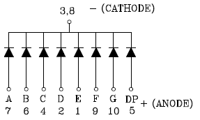
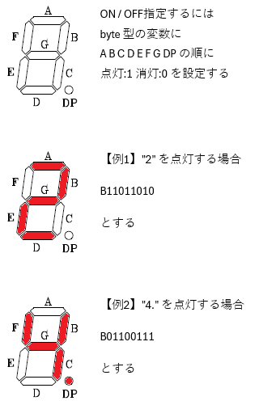
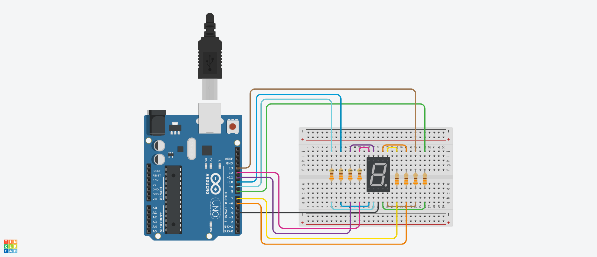
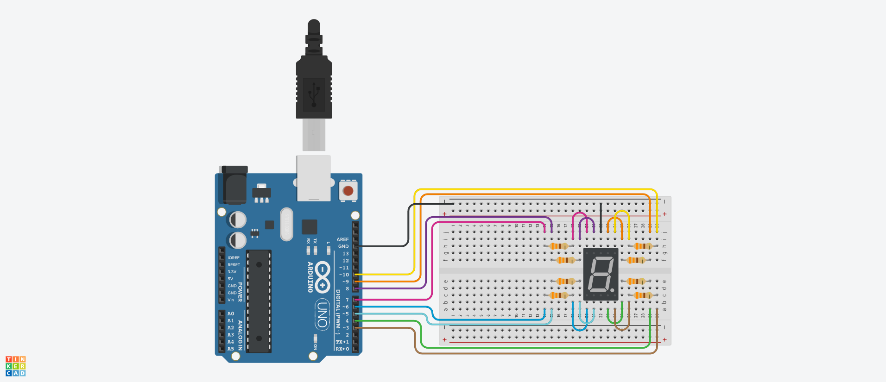
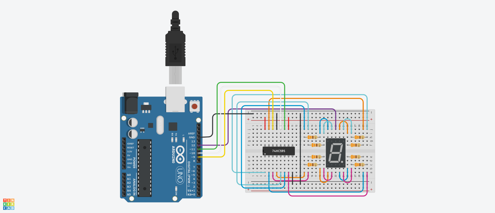

# Red7SegmentLedC551SRD Class 定義
## Ⅰ.概要
### Ⅰ-ⅰ クラスパラメータ

|Parameter |Value |Note |
|:---|---:|:---|
|namespace |ElectronicComponent |電子部品共通名前空間を使用する |
|template-spec |n/a |テンプレートの指定なし |
|ms-decl-spec |n/a |ストレージ クラスの指定なし |
|tag |Red7SegmentLed551SRD | |
|base |n/a |基本クラスの指定なし |

### Ⅰ-ⅱ 処理概要

Arduino 向け 7 セグメント LED C-551SRD-NW 用クラス定義  
1. 各 LED の状態をビット指定により一括で設定可能
2. カソード側への出力で明滅のコントロールが可能
3. 各 LED の点灯状態を取得できる
4. ピンアサインはシフトレジスタ利用を想定しアノードのみ、カソードのみおよびアノードとカソードを設定可能

## Ⅱ.メンバ定義
### Ⅱ-ⅰ.列挙定数
1. displayPattern

|No |ID |Access |Type |Value |Abstruct |
|:---:|:---|:---|:---:|---:|:---|
|1 |RED7SEGMENT_DISPLAY_PTN_1 |public |byte |B01100000 |表示パターン"1" |
|2 |RED7SEGMENT_DISPLAY_PTN_2 |public |byte |B11011010 |表示パターン"2" |
|3 |RED7SEGMENT_DISPLAY_PTN_3 |public |byte |B11110010 |表示パターン"3" |
|4 |RED7SEGMENT_DISPLAY_PTN_4 |public |byte |B01100110 |表示パターン"4" |
|5 |RED7SEGMENT_DISPLAY_PTN_5 |public |byte |B10110110 |表示パターン"5" |
|6 |RED7SEGMENT_DISPLAY_PTN_6 |public |byte |B10111110 |表示パターン"6" |
|7 |RED7SEGMENT_DISPLAY_PTN_7 |public |byte |B11100000 |表示パターン"7" |
|8 |RED7SEGMENT_DISPLAY_PTN_8 |public |byte |B11111110 |表示パターン"8" |
|9 |RED7SEGMENT_DISPLAY_PTN_9 |public |byte |B11110110 |表示パターン"9" |
|10 |RED7SEGMENT_DISPLAY_PTN_0 |public |byte |B11111100 |表示パターン"0" |
|11 |RED7SEGMENT_DISPLAY_PTN_1DP |public |byte |B01100001 |表示パターン"1." |
|12 |RED7SEGMENT_DISPLAY_PTN_2DP |public |byte |B11011011 |表示パターン"2." |
|13 |RED7SEGMENT_DISPLAY_PTN_3DP |public |byte |B11110011 |表示パターン"3." |
|14 |RED7SEGMENT_DISPLAY_PTN_4DP |public |byte |B01100111 |表示パターン"4." |
|15 |RED7SEGMENT_DISPLAY_PTN_5DP |public |byte |B10110111 |表示パターン"5." |
|16 |RED7SEGMENT_DISPLAY_PTN_6DP |public |byte |B10111111 |表示パターン"6." |
|17 |RED7SEGMENT_DISPLAY_PTN_7DP |public |byte |B11100001 |表示パターン"7." |
|18 |RED7SEGMENT_DISPLAY_PTN_8DP |public |byte |B11111111 |表示パターン"8." |
|19 |RED7SEGMENT_DISPLAY_PTN_9DP |public |byte |B11110111 |表示パターン"9." |
|20 |RED7SEGMENT_DISPLAY_PTN_0DP |public |byte |B11111101 |表示パターン"0." |

2. arraySubscript

|No |ID |Access |Type |Value |Abstruct |
|:---:|:---|:---|:---:|---:|:---|
|1 |ARRAY_SUBSCRIPT_A |private |int |0 |配列添え字(A) |
|2 |ARRAY_SUBSCRIPT_B |private |int |1 |配列添え字(B) |
|3 |ARRAY_SUBSCRIPT_C |private |int |2 |配列添え字(C) |
|4 |ARRAY_SUBSCRIPT_D |private |int |3 |配列添え字(D) |
|5 |ARRAY_SUBSCRIPT_E |private |int |4 |配列添え字(E) |
|6 |ARRAY_SUBSCRIPT_F |private |int |5 |配列添え字(F) |
|7 |ARRAY_SUBSCRIPT_G |private |int |6 |配列添え字(G) |
|8 |ARRAY_SUBSCRIPT_DP |private |int |7 |配列添え字(DP) |

### Ⅱ-ⅱ.定数
|No |ID |Access |Type |Value |Abstruct |
|:---:|:---|:---|:---:|---:|:---|
|1 |DIGITAL_NO_PIN |private |unsigned int |99U |ピン指定なし |
|2 |BIT_SHIFT_OFFSET |private |int |7 |ビットシフトオフセット値 |
|3 |BIT_PATTERN_MASK |private |byte |B00000001 |ビットパターンマスク |

### Ⅱ-ⅲ.変数
|No |ID |Access |Type |Abstruct |
|:---:|:---|:---|:---:|:---|
|1 |pinAnodeNo |private |unsigned int[8] |アノードピン番号の配列 | 
|2 |pinCathodeNo |private |unsigned int |カソードピン番号 | 
|3 |brightness |private |int[8] |点灯状態の配列 | 

### Ⅱ-ⅳ.メソッド
|No |ID |Access |Return Type |Abstract |
|:---:|:---|:---|:---:|:---|
|1 |Red7SegmentLed551SRD |public |void |コンストラクタ |
|2 |turnOff |public |void |全消灯 |
|3 |lightOn |public |void |全点灯 |
|4 |setBitPattern |public |void |点灯パターン設定 |
|5 |lightBitPattern |public |void |パターン指定点灯 |
|6 |getPinNoA |public |unsigned int |getter(Aピン番号) |
|7 |getPinNoB |public |unsigned int |getter(Bピン番号) |
|8 |getPinNoC |public |unsigned int |getter(Cピン番号) |
|9 |getPinNoD |public |unsigned int |getter(Dピン番号) |
|10 |getPinNoE |public |unsigned int |getter(Eピン番号) |
|11 |getPinNoF |public |unsigned int |getter(Fピン番号) |
|12 |getPinNoG |public |unsigned int |getter(Gピン番号) |
|13 |getPinNoDP |public |unsigned int |getter(DPピン番号) |
|14 |getPinNoCathode |public |unsigned int |getter(カソードピン番号) |
|15 |isBlightA |public |bool |getter(A点灯状態) |
|16 |isBlightB |public |bool |getter(B点灯状態) |
|17 |isBlightC |public |bool |getter(C点灯状態) |
|18 |isBlightD |public |bool |getter(D点灯状態) |
|19 |isBlightE |public |bool |getter(E点灯状態) |
|20 |isBlightF |public |bool |getter(F点灯状態) |
|21 |isBlightG |public |bool |getter(G点灯状態) |
|22 |isBlightDP |public |bool |getter(DP点灯状態) |

#### Ⅱ-ⅳ-1.Red7SegmentLed551SRD()
1. 引数

|No |ID |Type |Value |Optional |Abstract |
|:---:|:---|:---:|---:|:---:|:---|
|1 |pinNoAnodeA |unsigned int |- |true |アノード(A)対向ピン番号 |
|2 |pinNoAnodeB |unsigned int |- |true |アノード(B)対向ピン番号 |
|3 |pinNoAnodeC |unsigned int |- |true |アノード(C)対向ピン番号 |
|4 |pinNoAnodeD |unsigned int |- |true |アノード(D)対向ピン番号 |
|5 |pinNoAnodeE |unsigned int |- |true |アノード(E)対向ピン番号 |
|6 |pinNoAnodeF |unsigned int |- |true |アノード(F)対向ピン番号 |
|7 |pinNoAnodeG |unsigned int |- |true |アノード(G)対向ピン番号 |
|8 |pinNoAnodeDP |unsigned int |- |true |アノード(DP)対向ピン番号 |
|9 |pinNoCathode |unsigned int |- |true |カソード対向ピン番号 |

2. 処理概要

* 引数の内容にてメンバ変数を初期化する。アノード対向ピンは LED-A, LED-B, LED-C, LED-D, LED-E, LED-F, LED-G, LED-DP の順で指定する  
  
  1. カソードピンのみ引数で指定された場合  
アノードピンはすべて無指定(DIGITAL_NO_PIN)としてデリゲートすること
  1. アノードピンのみ引数で指定された場合  
カソードピンは無指定(DIGITAL_NO_PIN)としてデリゲートすること
  1. 全てのピンが引数で指定された場合  
以下の内容で初期化する  

|ID |Value |Note |
|:---|---:|:---|
|pinAnodeNo[0] |pinNoAnodeA |アノード(A)対向ピン番号 |
|pinAnodeNo[1] |pinNoAnodeB |アノード(B)対向ピン番号 |
|pinAnodeNo[2] |pinNoAnodeC |アノード(C)対向ピン番号 |
|pinAnodeNo[3] |pinNoAnodeD |アノード(D)対向ピン番号 |
|pinAnodeNo[4] |pinNoAnodeE |アノード(E)対向ピン番号 |
|pinAnodeNo[5] |pinNoAnodeF |アノード(F)対向ピン番号 |
|pinAnodeNo[6] |pinNoAnodeG |アノード(G)対向ピン番号 |
|pinAnodeNo[7] |pinNoAnodeDP |アノード(DP)対向ピン番号 |
|pinCathodeNo |pinNoCathode |カソード対向ピン番号 |
|brightness[0] |false |LED-A の点灯状態(消灯) |
|brightness[2] |false |LED-B の点灯状態(消灯) |
|brightness[3] |false |LED-C の点灯状態(消灯) |
|brightness[3] |false |LED-D の点灯状態(消灯) |
|brightness[4] |false |LED-E の点灯状態(消灯) |
|brightness[5] |false |LED-F の点灯状態(消灯) |
|brightness[6] |false |LED-G の点灯状態(消灯) |
|brightness[7] |false |LED-DP の点灯状態(消灯) |

> [!WARNING]
> 3 番と 8 番がカソードとなるが、内部で結線されているためどちらか一つのみ使用すること(fig2-1 参照)  
  
**fig2-1 カソードの結線(データシートより抜粋)**  

#### Ⅱ-ⅳ-2.turnOff()
1. 引数

なし

2. 処理概要

* カソードの状態を HIGH として全ての LED を消灯する
* 全ての LED の点灯状態を false にする

#### Ⅱ-ⅳ-3.lightOn()
1. 引数

なし

2. 処理概要

* カソードの状態を LOW として全ての LED を点灯する
* 全ての LED の点灯状態を true にする

#### Ⅱ-ⅳ-4.setBitPattern()
1. 引数

|No |ID |Type |Value |Optional |Abstract |
|:---:|:---|:---:|---:|:---:|:---|
|1 |lightPattern |byte |- |false |点灯パターン指定 |

2. 処理概要

* 引数で指定されたパターンで全 LED の状態を設定する
* A,B,C,D,E,F,G,DP の順で点灯は 1、消灯は 0 でビット列を生成すること(fig2-2参照)
  
**fig2-2 ビット列によるパターン指定**  

#### Ⅱ-ⅳ-5.lightBitPattern()
1. 引数

|No |ID |Type |Value |Optional |Abstract |
|:---:|:---|:---:|---:|:---:|:---|
|1 |lightPattern |byte |- |false |点灯パターン指定 |

2. 処理概要

* 全 LED の状態を指定して点灯する  
  1. turnOff() をコールして消灯する  
  2. lightBitPattern() をコールして点灯状態を設定する(引数はそのまま渡す)  
  3. lightOn() をコールして点灯する

#### Ⅱ-ⅳ-6.getPinNoA()
1. 引数

なし

2. 処理概要

* アノードピン(A)の番号を返す

#### Ⅱ-ⅳ-7.getPinNoB()
1. 引数

なし

2. 処理概要

* アノードピン(B)の番号を返す

#### Ⅱ-ⅳ-8.getPinNoC()
1. 引数

なし

2. 処理概要

* アノードピン(C)の番号を返す

#### Ⅱ-ⅳ-9.getPinNoD()
1. 引数

なし

2. 処理概要

* アノードピン(D)の番号を返す

#### Ⅱ-ⅳ-10.getPinNoE()
1. 引数

なし

2. 処理概要

* アノードピン(E)の番号を返す

#### Ⅱ-ⅳ-11.getPinNoF()
1. 引数

なし

2. 処理概要

* アノードピン(F)の番号を返す

#### Ⅱ-ⅳ-12.getPinNoG()
1. 引数

なし

2. 処理概要

* アノードピン(G)の番号を返す

#### Ⅱ-ⅳ-13.getPinNoDP()
1. 引数

なし

2. 処理概要

* アノードピン(DP)の番号を返す

#### Ⅱ-ⅳ-14.getPinNoCathode()
1. 引数

なし

2. 処理概要

* カソードピン番号を返す

#### Ⅱ-ⅳ-15.isBlightA()
1. 引数

なし

2. 処理概要

* アノード(A)の点灯状態が HIGH ならば true、LOW ならば false を返す

#### Ⅱ-ⅳ-16.isBlightB()
1. 引数

なし

2. 処理概要

* アノード(B)の点灯状態が HIGH ならば true、LOW ならば false を返す

#### Ⅱ-ⅳ-17.isBlightC()
1. 引数

なし

2. 処理概要

* アノード(C)の点灯状態が HIGH ならば true、LOW ならば false を返す

#### Ⅱ-ⅳ-18.isBlightD()
1. 引数

なし

2. 処理概要

* アノード(D)の点灯状態が HIGH ならば true、LOW ならば false を返す

#### Ⅱ-ⅳ-19.isBlightE()
1. 引数

なし

2. 処理概要

* アノード(E)の点灯状態が HIGH ならば true、LOW ならば false を返す

#### Ⅱ-ⅳ-20.isBlightF()
1. 引数

なし

2. 処理概要

* アノード(F)の点灯状態が HIGH ならば true、LOW ならば false を返す

#### Ⅱ-ⅳ-21.isBlightG()
1. 引数

なし

2. 処理概要

* アノード(G)の点灯状態が HIGH ならば true、LOW ならば false を返す

#### Ⅱ-ⅳ-22.isBlightDP()
1. 引数

なし

2. 処理概要

* アノード(DP)の点灯状態が HIGH ならば true、LOW ならば false を返す

## Ⅲ.特記事項
### Ⅲ-ⅰ.利用上の注意
このクラスは Arduino での利用を想定しているため、他のマイコンボードでの動作は保証しない

### Ⅲ-ⅱ.利用方法
#### Ⅲ-ⅱ-1.アノードとカソードをすべて Arduino に接続する場合
アノード対向ピン、カソード対向ピンの順で指定してインスタンス生成すること  
アノード対向ピンは LED-A, LED-B, LED-C, LED-D, LED-E, LED-F, LED-G, LED-DP の順で指定すること  

```
Red7SegmentLedC551SRD * my7SegmentLed;
my7SegmentLed = new Red7SegmentLedC551SRD( 6U, 7U, 8U, 9U, 10U, 11U, 12U, 13U, 4U );
```


**fig3-1 アノードとカソードをすべて Arduinoに 接続する場合の配線例**  

#### Ⅲ-ⅱ-2.アノードのみ Arduino に接続する場合
カソードを GND に繋ぐ場合などはアノード対向ピンのみ指定してインスタンス生成すること  
アノード対向ピンは LED-A, LED-B, LED-C, LED-D, LED-E, LED-F, LED-G, LED-DP の順で指定すること  

```
Red7SegmentLedC551SRD * my7SegmentLed;
my7SegmentLed = new Red7SegmentLedC551SRD( 9U, 10U, 4U, 5U, 6U, 8U, 7U, 3U );
```


**fig3-2 アノードのみ Arduino に接続する場合の配線例**  

#### Ⅲ-ⅱ-3.カソードのみ Arduino に接続する場合
シフトレジスタでシリアルパラレル変換を行うなど、アノード側のピンを使用しない場合はカソード対向ピンのみ指定してインスタンス生成すること

```
Red7SegmentLedC551SRD * my7SegmentLed;
my7SegmentLed = new Red7SegmentLedC551SRD( 12U );
```


**fig3-3 カソードのみ Arduino に接続する場合の配線例**  

#### Ⅲ-ⅱ-4.点灯パターンを指定して点灯させる
lightBitPattern() をコールすると指定パターンで点灯する  

```
// "1."を点灯する
my7SegmentLed->lightBitPattern( B01100001 );
```

#### Ⅲ-ⅱ-5.点灯パターンのみ指定する
ダイナミックドライブを利用する場合など、点灯タイミングを調整したい場合は setBitPattern() をコールすると点灯パターンのみ指定できる。このとき、点灯指定したアノードへの出力は HIGH となる

```
// "2"を設定する
setBitPattern( B11011010 );
```

#### Ⅲ-ⅱ-6.消灯する
turnOff() をコールするとカソードを LOW とする。アノードの状態にかかわらず全ての LED は消灯する

```
// 全 LED を消灯する
turnOff();
```

#### Ⅲ-ⅱ-7.点灯する
lightOn() をコールするとカソードを LOW とする。このとき、点灯指定したアノードが点灯する

```
// 点灯する(点灯パターンは別途指定されている)
lightOn();
```

### Ⅲ-ⅲ.サンプルスケッチ
サンプルスケッチで使用する配線例は fig3-4 を参照


**fig3-4 サンプルスケッチ用配線例**  
1. 最初に全 LED を 1 秒点灯、1 秒消灯する。その後 LED-A から LED-DP を順番に 1 秒点灯、1 秒消灯を行う  
1. "1"→"2"→"3"→"4"→"5"→"6"→"7"→"8"→"9"→"0"→"1."→"2."→"3."→"4."→"5."→"6."→"7."→"8."→"9."→"0." の順に 1 秒点灯し、1 秒消灯するパターンを繰り返す  
