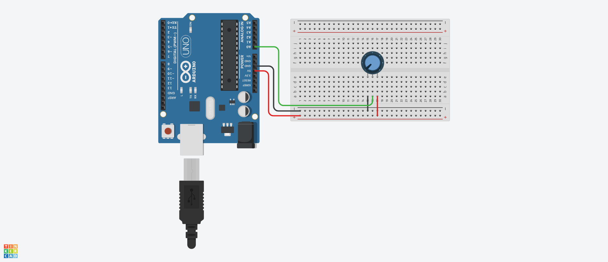

# SemiFixedResistorTSR3386T Class 定義
## Ⅰ.概要
### Ⅰ-ⅰ クラスパラメータ

|Parameter |Value |Note |
|:---|---:|:---|
|namespace |ElectronicComponent |電子部品共通名前空間を使用する |
|template-spec |n/a |テンプレートの指定なし |
|ms-decl-spec |n/a |ストレージ クラスの指定なし |
|tag |SemiFixedResistorTSR3386T | |
|base |n/a |基本クラスの指定なし |

### Ⅰ-ⅱ 処理概要
Arduino 向け半固定抵抗  用クラス定義
1. ADC による入力値から入力電圧を算出する
1. 測定した値を取得できる

## Ⅱ.メンバ定義
### Ⅱ-ⅰ.定数
|No |ID |Access |Type |Value |Abstruct |
|:---:|:---|:---|:---:|---:|:---|
|1 |ADC_RESOLUTION |private |float |1024.0F |ADC 分解能 |
|2 |REFERENCE_VOLTAGE |private |float |5.0F |基準電圧 |

### Ⅱ-ⅱ.変数
|No |ID |Access |Type |Abstruct |
|:---:|:---|:---|:---:|:---|
|1 |inputPinNo |private |unsgined int |アナログ入力ピン | 
|2 |analogInputVoltage |private |float |アナログ入力電圧(換算値) | 
|3 |analogDigitalConvValue |private |int |アナログデジタル変換値 | 

### Ⅱ-ⅲ.メソッド
|No |ID |Access |Return Type |Abstract |
|:---:|:---|:---|:---:|:---|
|1 |SemiFixedResistorTSR3386T |public |void |コンストラクタ |
|2 |acquireMeasuredVoltage |public |float |計測電圧取得 |
|3 |acquireADCValue |public |int |ADC値取得 |
|4 |analogInputValueMeasurement |private |void |アナログ入力値計測 |

> [!NOTE]
> デストラクタなし  

#### Ⅱ-ⅲ-1.SemiFixedResistorTSR3386T()
1. 引数

|No |ID |Type |Value |Optional |Abstract |
|:---:|:---|:---:|---:|:---:|:---|
|1 |inputPin |unsigned int |- |false |アナログ入力ピン番号 |

2. 処理概要

* コンストラクタとして呼ばれ、以下のメンバを初期化する

|ID |Value |Note |
|:---|---:|:---|
|inputPinNo |inputPin | | 
|analogInputVoltage |0.0F | | 
|analogDigitalConvValue |0 | | 

#### Ⅱ-ⅲ-2.acquireMeasuredVoltage()
1. 引数  
なし

2. 処理概要
* analogInputValueMeasurement() をコールして計測値を取得する
* メンバ アナログ入力電圧 の値を返す

#### Ⅱ-ⅲ-3.acquireADCValue()
1. 引数  
なし

2. 処理概要
* analogInputValueMeasurement() をコールして計測値を取得する
* メンバ アナログデジタル変換値 の値を返す

#### Ⅱ-ⅲ-4.analogInputValueMeasurement()
1. 引数  
なし

2. 処理概要

* アナログ入力ピンからメンバ アナログデジタル変換値 の値を取得する
* メンバ アナログデジタル変換値 ($ADC$) から換算電圧 ($V$) を以下式で算出してメンバ アナログ入力電圧 に格納する  
$V = \left( \frac{ADC}{1024} \cdot V_{ref} \right)$

## Ⅲ.特記事項
このクラスは Arduino での利用を想定しているため、他のマイコンボードでの動作は保証しない

### Ⅲ-ⅱ.利用方法
#### Ⅲ-ⅱ-1.初期化
1. setup() 内でクラスインスタンスを生成する。アナログ入力ピン番号を指定すること

```
SemiFixedResistorTSR3386T* myResistor;
myResistor = new SemiFixedResistorTSR3386T( A0 );
```

#### Ⅲ-ⅱ-2.計測して値を取得
1. 換算電圧を取得する場合、acquireMeasuredVoltage() をコールする

```
float voltage = myResistor->acquireMeasuredVoltage();
```

2. ADC 値を取得する場合、acquireADCValue() をコールする

```
int adcValue = myResistor->acquireADCValue();
```

### Ⅲ-ⅲ.サンプルスケッチ
  
**fig3-1 サンプルスケッチ動作用回路**

サンプルスケッチは fig3-1 のように回路を作成すること  
1 秒ごとに半固定抵抗器から入力電圧を取得する
PC 側のシリアルモニタに計測時間(経過ミリ秒)と計測値(ADC 値および換算電圧)を表示する(以下例参照)

```
Ready...
4291 :: ADC - 1001, Voltage - 2.50V
```
