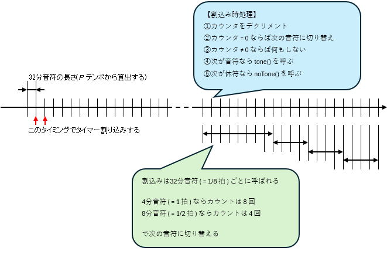
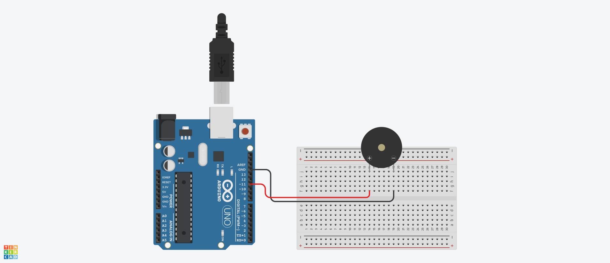

# SpeakerPT08Z185R Class 定義
## Ⅰ.概要
### Ⅰ-ⅰ クラスパラメータ

|Parameter |Value |Note |
|:---|---:|:---|
|namespace |ElectronicComponent |電子部品共通名前空間を使用する |
|template-spec |n/a |テンプレートの指定なし |
|ms-decl-spec |n/a |ストレージ クラスの指定なし |
|tag |SpeakerPT08Z185R | |
|base |n/a |基本クラスの指定なし |

### Ⅰ-ⅱ 処理概要
Arduino 向け圧電スピーカ PT08-Z185R 用クラス定義 

1. テンポ、音階および音符種別を与えることで、指定した音高を指定時間鳴らすことができる
2. パラメータの組を配列で与えることでメロディー演奏することができる
3. 演奏はリピートも 1 回のみ演奏もどちらも可能
4. 演奏中に停止することができる

  
**fig1-1 本クラスによる演奏の基本動作** 

## Ⅱ.メンバ定義
### Ⅱ-ⅰ.列挙定数
1. metronom  
テンポ標語と拍数の定義

|No |ID |Access |Type |Value |Abstruct |
|:---:|:---|:---|:---:|---:|:---|
|1 |METRONOM_GRAVE |public |unsigned int |40U |Grave |
|2 |METRONOM_LARGO |public |unsigned int |46U |Largo |
|3 |METRONOM_LENTO |public |unsigned int |52U |Lento |
|4 |METRONOM_ADAGIO |public |unsigned int |56U |Adagio |
|5 |METRONOM_LARGHETTO |public |unsigned int |60U |Larghetto |
|6 |METRONOM_ADAGIETTO |public |unsigned int |66U |Adagietto |
|7 |METRONOM_ANDANTE |public |unsigned int |72U |Andante |
|8 |METRONOM_ANDANTINO |public |unsigned int |80U |Andantino |
|9 |METRONOM_MAESTOSO |public |unsigned int |88U |Maestoso |
|10 |METRONOM_MODERATO |public |unsigned int |96U |Moderato |
|11 |METRONOM_ALLEGRETTO |public |unsigned int |108U |Allegretto |
|12 |METRONOM_ANIMATO |public |unsigned int |120U |Animato |
|13 |METRONOM_ALLEGRO |public |unsigned int |132U |Allegro |
|14 |METRONOM_ASSAI |public |unsigned int |144U |Assai |
|15 |METRONOM_VIVACE |public |unsigned int |160U |Vivace |
|16 |METRONOM_PRESTO |public |unsigned int |184U |Presto |
|17 |METRONOM_PRESTISSIMO |public |unsigned int |208U |Prestissimo |

2. continuousPlayback  

|No |ID |Access |Type |Value |Abstruct |  
|:---:|:---|:---|:---:|---:|:---|
|1 |PLAY_LOOP |public |bool |true |リピート再生 |
|2 |PLAY_ONCE |public |bool |false |1 回のみ再生 |

### Ⅱ-ⅱ.定数
|No |ID |Access |Type |Value |Abstruct |
|:---:|:---|:---|:---:|---:|:---|
|1 |MICROSECONDS_PER_MINUTE |private |float |60000000.0F |1 分間のマイクロ秒表現 |
|2 |THIRTY_SECOND_NOTE |private |float |(1.0F/8.0F) |三十二分音符の拍数 |

### Ⅱ-ⅲ.変数
|No |ID |Access |Type |Abstruct |
|:---:|:---|:---|:---:|:---|
|1 |pinNo |private |unsigned int |出力ピン番号 | 
|2 |lengthBeat |private |unsigned long |1/8 拍の長さ(マイクロ秒) | 
|3 |musicalData |private |MusicalComposition::musicData* |楽曲データ | 
|4 |counter |private |int |音程切替用カウンタ | 
|5 |insicator |private |int |楽曲データ用インジケータ | 
|6 |isLoop |private |bool |再生ループ指定(true でループ再生、falseで一回のみ再生) | 

> [!NOTE]
> MusicalComposition::musicData については、[MusicalComposition の定義ドキュメント](./MusicalComposition.md)を参照すること

### Ⅱ-ⅳ.メソッド
|No |ID |Access |Return Type |Abstract |
|:---:|:---|:---|:---:|:---|
|1 |SpeakerPT08Z185R |public |void |コンストラクタ |
|2 |alarmSwitchingDecision |private |void |鳴動切替判定 |
|3 |tempoInMicroseconds |private |unsigned long |テンポミリ秒換算 |
|4 |pitchAcquisition |private |void |音高取得 |
|5 |startPlaying |public |void |演奏開始 |
|6 |stopPlaying |public |void |演奏停止 |
|7 |getPinNo |public |unsigned int |getter:出力ピン番号 |

> [!NOTE]
> デストラクタなし  

#### Ⅱ-ⅳ-1.SpeakerPT08Z185R()
1. 引数

|No |ID |Type |Value |Optional |Abstract |
|:---:|:---|:---:|---:|:---:|:---|
|1 |pinNo |unsigned int |- |false |出力信号ピン番号 |
|2 |tempo |unsigned int |METRONOM_LARGHETTO |true |テンポ |
|3 |musicalData |MusicalComposition::musicData* |- |false |楽曲データ |

2. 処理概要

* コンストラクタとして呼ばれ、以下のメンバを初期化する  
> [!WARNING]
> 引数のうちテンポは省略可能。省略した場合は METRONOM_LARGHETTO とみなしてデリゲートすること

|ID |Value |Note |
|:---|---:|:---|
|pinNo |pinNo | |
|lengthBeat |tempoInMicroseconds() の戻り値 |1/8 拍あたりのマイクロ秒 |
|musicalData |musicalData | |
|counter |0 | |
|insicator |0 | |
|isLoop |true | |

#### Ⅱ-ⅳ-2.alarmSwitchingDecision()
1. 引数  
なし  

2. 処理概要  

> [!IMPORTANT]
> この関数はタイマー(TimerOne)により一定時間ごとにコールされる。呼び出し間隔はテンポに基づいて tempoInMicroseconds() にて算出される

* メンバ 音程切替用カウンタ をデクリメントする
* メンバ 音程切替用カウンタ <= 0 である場合  
  1. pitchAcquisition() をコールして次の音高、長さを取得する
  1. 音高指定値が MUSICAL_SCALE_END かつメンバ 再生ループ指定 が true である場合、メンバ 音程切替用カウンタ を MUSICAL_REST_1 の値とし、noTone() で音を止める 
  1. 音高指定値が MUSICAL_SCALE_END かつメンバ  が false である場合、stopPlaying() をコールする 
  1. 長さをメンバ 音程切替用カウンタ に代入する
  1. 音符である場合、tone() で音高指定を行う。休符である場合、noTone() で音を止める

* メンバ 音程切替用カウンタ > 0 である場合は何もしない

#### Ⅱ-ⅳ-3.tempoInMicroseconds()
1. 引数

|No |ID |Type |Value |Optional |Abstract |
|:---:|:---|:---:|---:|:---:|:---|
|1 |tempo |unsigned int |- |false |テンポ |

2. 処理概要
引数のテンポ tempo から 1/8 拍(32 分音符の長さ)あたりのマイクロ秒 P を算出して返す  
$P =  \left( \frac{60000000}{tempo} \cdot \frac{1}{8} \right)$

> [!IMPORTANT]
> 項用の定数として MICROSECONDS_PER_MINUTE および THIRTY_SECOND_NOTE を利用すること

#### Ⅱ-ⅳ-4.pitchAcquisition()
1. 引数

|No |ID |Type |Value |Optional |Abstract |
|:---:|:---|:---:|---:|:---:|:---|
|1 |musicalData |MusicalComposition::musicData* |- |false |データ返却用構造体へのポインタ |

2. 処理概要

* メンバ 楽曲データ 配列からメンバ 楽曲データ用インジケータ 位置にあるデータを取得する
* メンバ 楽曲データ用インジケータ をインクリメントする

#### Ⅱ-ⅳ-5.startPlaying()
1. 引数  
|No |ID |Type |Value |Optional |Abstract |
|:---:|:---|:---:|---:|:---:|:---|
|1 |isLoop |bool |- |true |リピート再生有無の指定 |

2. 処理概要

> [!WARNING]
> 引数は省略可能。省略した場合は PLAY_LOOP とみなしてデリゲートすること

* メンバ 再生ループ指定 に isLoop の値を設定する
* メンバ 楽曲データ用インジケータ を 0U で初期化する
* タイマーを起動する

#### Ⅱ-ⅳ-6.stopPlaying()
1. 引数  
なし

2. 処理概要

* noTone() をコールして音を止める
* タイマーを停止する

#### Ⅱ-ⅳ-7.getPinNo()
1. 引数  
なし

2. 処理概要  

* メンバ 出力ピン番号 を返す

## Ⅲ.特記事項
### Ⅲ-ⅰ.利用上の注意
1. このクラスは Arduino での利用を想定しているため、他のマイコンボードでの動作は保証しない
2. このクラスでは TimerOne ライブラリの利用を前提としているため、あらかじめインストールしておくこと
3. このクラスでは MsTimer2 ライブラリの利用を前提としているため、あらかじめインストールしておくこと

### Ⅲ-ⅱ.利用方法
#### Ⅲ-ⅱ-1.初期化

1. MusicalComposition::musicData の配列として楽曲データを定義する
> [!WARNING]
> Arduino UNO では vector は利用できない

2. setup() 内でクラスインスタンスを生成する。ピン番号、テンポおよび楽曲データを引数として渡すこと

> [!CAUTION]
> TimerOne ライブラリを利用するため デジタルピン D9,D10 は利用できない。また、tone() を利用するため、デジタルピン D3,D11 は利用できない

```
SpeakerPT08Z185R* mySpeaker;
MusicalComposition::musicData myData[] = {
    …
}
mySpeaker = new SpeakerPT08Z185R( 6U, 84U, myData );
```
> [!TIP]
> テンポを省略した場合は METRONOM_LARGHETTO (=60U) とみなされる

3. startPlaying() をコールして楽曲の再生を開始する
```
mySpeaker->startPlaying( PLAY_LOOP );
```

#### Ⅲ-ⅱ-2.楽曲の演奏をを停止  
1. stopPlaying() をコールすると楽曲の再生を停止する
```
mySpeaker->stopPlaying();
```

#### Ⅲ-ⅱ-3.楽曲の演奏を再開  
1. startPlaying() をコールして楽曲の再生を開始する。このとき楽曲の先頭から再生される
```
mySpeaker->startPlaying( PLAY_ONCE );
```

### Ⅲ-ⅲ.サンプルスケッチ
サンプルスケッチ SpeakerPT08Z185R.ino の配線例は fig3-1 を参照  
  
**fig3-1 サンプルスケッチ動作用回路**  
自動的に楽曲が再生される
