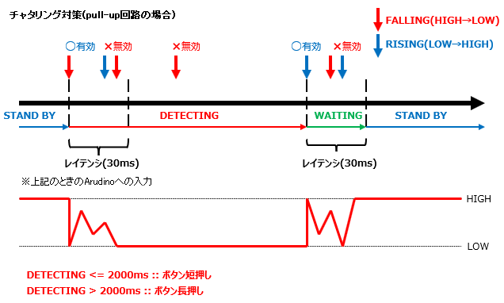

# Tact Switch DTS6V Class 定義
## Ⅰ.概要
### Ⅰ-ⅰ クラスパラメータ

|Parameter |Value |Note |
|:---|---:|:---|
|namespace |ElectronicComponent |電子部品共通名前空間を使用する |
|template-spec |n/a |テンプレートの指定なし |
|ms-decl-spec |n/a |ストレージ クラスの指定なし |
|tag |TactSwitchDTS6V | |
|base |n/a |基本クラスの指定なし |

### Ⅰ-ⅱ 処理概要
Arduino 向けタクトスイッチ DTS6V 用クラス定義  
1. プルアップ抵抗およびプルダウン抵抗を用いた回路どちらにも対応  

  
**fig1-1 pull-up 回路の例**  

  
**fig1-2 pull-down 回路の例**  

2. 長押し/短押し判定あり  
1. スイッチ押下の判定は、外部割込みにて行う  
1. 外部割込み使用できない場合でも使用可能  
1. チャタリング対策は一定時間入力無効とすることで対応(fig1-3を参照)  

  
**fig1-3 チャタリング対策**  

6. スイッチは状態 Stand-by 、 Detecting および Waiting を持つ
1. 状態遷移条件は以下表を参照
   
|ステータス|遷移前状態|移行条件|
|:---:|:---:|:---|
|Stand-by|Waiting|Waiting 移行後、指定時間が経過したとき|
|Detecting|Stand-by|スイッチが押されピン状態が HIGH から LOW もしくは LOW から HIGH に変化したとき|
|Waiting|Detecting|Detecting 移行後、指定時間が経過しかつ、スイッチが離されたとき|

8. Detecting および Waiting 状態になってから一定時間(無指定の場合 30msec)の間入力を受け付けない
1. Waiting 状態になったとき、 Detecing 状態に遷移してからの経過時間(無指定の場合 2000msec)により長押しであるか判定する

## Ⅱ.メンバ定義
### Ⅱ-ⅰ.列挙定数
1. returnvalue

|No |ID |Access |Type |Value |Abstruct |
|:---:|:---|:---|:---:|---:|:---|
|1 |RET_SKIP |public |int |-99 |戻り値(判定なし) |
|2 |RET_PUSHING |pubric |int |1 |戻り値(押されている状態) |
|3 |RET_SHORTDOWN |pubric |int |2 |戻り値(押された) |
|4 |RET_HOLDDOWN |pubric |int |3 |戻り値(長押しされた) |

2. intarnalReturnValue

|No |ID |Access |Type |Value |Abstruct |
|:---:|:---|:---|:---:|---:|:---|
|1 |RET_CHANGED |private |int |4 |戻り値(ステータス変更あり) |
|2 |RET_NOCHANGE |private |int |5 |戻り値(ステータス変更なし) |

3. statusValue

|No |ID |Access |Type |Value |Abstruct |
|:---:|:---|:---|:---:|---:|:---|
|1 |SW_STS_STANDBY |private |int |0 |ステータス(待機) |
|2 |SW_STS_DETECTING |private |int |1 |ステータス(検知中) |
|3 |SW_STS_WAITING |private |int |2 |ステータス(復帰待ち) |

4. cercitType

|No |ID |Access |Type |Value |Abstruct |
|:---:|:---|:---|:---:|---:|:---|
|1 |TYPE_PULLUP |pubric |int |0 |回路区分(プルアップ) |
|2 |TYPE_PULLDOWN |pubric |int |1 |回路区分(プルダウン) |

### Ⅱ-ⅱ.定数
|No |ID |Access |Type |Value |Abstruct |
|:---:|:---|:---|:---:|---:|:---|
|1 |DEF_LATENCY |private |unsigned long |30UL |レイテンシ規定値 |
|2 |LATENCY_MAX |private |unsigned long |50UL |レイテンシ上限値 |
|3 |DEF_HOLDDOWN |private |unsigned long |2000UL |長押し判定時間閾値規定値 |
|4 |HOLDDOWN_MIN |private |unsigned long |1000UL |長押し判定時間閾値下限値 |
|5 |HOLDDOWN_MAX |private |unsigned long |8000UL |長押し判定時間閾値上限値 |

### Ⅱ-ⅲ.変数
|No |ID |Access |Type |Abstruct |
|:---:|:---|:---|:---:|:---|
|1 |pin |private |int |対向 Arduino ピン番号 | 
|2 |swStatus |private |int |処理ステータス | 
|3 |detectTime |private |unsigned long |ステータス変更時刻(開始時からの経過 msec) | 
|4 |isInterrupt |private |bool |割り込み有無 | 
|5 |connected |private |int |未接続時状態 | 
|6 |unconnected |private |int |接続時状態 | 
|7 |latency |private |unsigned long |チャタリング防止レイテンシ | 
|8 |holdDownTime |private |unsigned long |長押し判定時間閾値 | 

### Ⅱ-ⅳ.メソッド
|No |ID |Access |Return Type |Abstract |
|:---:|:---|:---|:---:|:---|
|1 |TactSwitchDTS6V |pubric |void |コンストラクタ |
|2 |startDetect |private |int |ステータス判定(to DETECTING) |
|3 |startWait |private |int |ステータス判定(to WAITING) |
|4 |startStandby |private |int |ステータス判定(to STAND_BY) |
|5 |setLatency |pubric |void |チャタリング防止レイテンシ設定 |
|6 |setHoldDown |pubric |void |長押し判定時間閾値設定 |
|7 |setNoInterrupt |pubric |void |割り込みなし設定 |
|8 |startInterrupt |pubric |void |割り込み時の判定 |
|9 |getCondition |pubric |int |タクトスイッチ状態判定 |

> [!NOTE]
> デストラクタなし  

#### Ⅱ-ⅳ-1.TactSwitchDTS6V()
1. 引数

|No |ID |Type |Value |Optional |Abstract |
|:---:|:---|:---:|---:|:---:|:---|
|1 |inputPin |int |- |False |Arduino側ピン番号 |
|2 |typePull |const int |- |True |回路区分(pull-up/pull-down) ※省略時は TYPE_PULLUP を設定 |

2. 処理概要

* コンストラクタとして呼ばれ、以下のメンバを初期化する

> [!WARNING]
> 引数のうち回路区分は省略可能。省略した場合は pull-up とみなしてデリゲートすること

|ID |Value |Note |
|:---|---:|:---|
|pin |inputPin | |
|swStatus |SW_STS_STANDBY |初期状態は STAND-BY とする |
|detectTime |0UL |0 の場合値未設定とみなす |
|isInterrupt |true | |
|latency |DEF_LATENCY |規定値は 30(msec) |
|holdDownTime |DEF_HOLDDOWN |規定値は 2000(msec) |

* 未接続時状態 / 接続時状態については引数回路区分の値で初期値を変える

|ID |Value |Note |
|:---|---:|:---|
|unconnected |HIGH |回路が pull-up の場合未入力は HIGH となる |
|connected |LOW |回路が pull-up の場合入力時は LOW となる |

**回路区分が TYPE_PULLUP の場合**  

|ID |Value |Note |
|:---|---:|:---|
|unconnected |LOW |回路が pull-down の場合未入力は LOW となる |
|connected |HIGH |回路が pull-down の場合入力時は HIGH となる |

**回路区分が TYPE_PULLDOWN の場合**  

> [!TIP]
> 引数 inputPin で指定するピンについて。Arduino UNO の場合外部割込み可能なピンは D2 もしくは D3 となるため、どちらかに接続すること。接続できない場合は setNoInterrupt() をコールして外部割込みなしとする必要がある  

#### Ⅱ-ⅳ-2.startDetect()
1. 引数

なし  

2. 処理概要
* 処理ステータスが STAND-BY のとき、ステータスを DETECTING へ移行させる
  - メンバ ステータス変更時刻に現在の経過ミリ秒を設定する  
  - ステータス変更ありを返す
* それ以外の場合ステータス変更なしを返す

#### Ⅱ-ⅳ-3.startWait()
1. 引数

|No |ID |Type |Value |Optional |Abstract |
|:---:|:---|:---:|---:|:---:|:---|
|1 |detectTime |unsigned long |- |False |ステータス変更からの経過時間 |

2. 処理概要
* 処理ステータスが DETECTING のとき、ステータスを WAITING へ移行させる
  - メンバ ステータス変更時刻に現在の経過ミリ秒を設定する  
  - ステータス変更ありを返す
* それ以外の場合ステータス変更なしを返す

#### Ⅱ-ⅳ-4.startStandby()
1. 引数

|No |ID |Type |Value |Optional |Abstract |
|:---:|:---|:---:|---:|:---:|:---|
|1 |detectTime |unsigned long |- |False |ステータス変更からの経過時間 |

2. 処理概要
* 処理ステータスが STAND-BY のとき、ステータスを STAND-BY へ移行させる
  - メンバ ステータス変更時刻に 0 を設定する  
  - ステータス変更ありを返す
* それ以外の場合ステータス変更なしを返す

#### Ⅱ-ⅳ-5.setLatency()
1. 引数

|No |ID |Type |Value |Optional |Abstract |
|:---:|:---|:---:|---:|:---:|:---|
|1 |inValue |unsigned long |- |False |レイテンシ |

2. 処理概要
* 引数の値でメンバ チャタリング防止レイテンシの値を更新する
  - 値の範囲は 0 ～ 50 (単位 :msec)とする

#### Ⅱ-ⅳ-6.setHoldDown()
1. 引数  

|No |ID |Type |Value |Optional |Abstract |
|:---:|:---|:---:|---:|:---:|:---|
|1 |inValue |unsigned long |- |False |長押し判定時間閾値 |

2. 処理概要  
* 引数の値でメンバ 長押し判定時間閾値の値を更新する
  - 値の範囲は 1000 ～ 8000 (単位 :msec)とする

#### Ⅱ-ⅳ-7.setNoInterrupt()
1. 引数  

なし  

2. 処理概要  
* メンバ 割り込み有無の値を false に設定する

#### Ⅱ-ⅳ-8.startInterrupt()
1. 引数  

なし  

2. 処理概要  
> [!IMPORTANT]
> このメソッドは外部割込み利用するときにコールされる。attachInterrupt() にて本メソッドを呼ぶ割り込み処理を定義する必要がある  

* 処理ステータスが STAND-BY のとき、ステータスを DETECTING へ移行させる
  - メンバ ステータス変更時刻に現在の経過ミリ秒を設定する

#### Ⅱ-ⅳ-9.getCondition()
1. 引数  

なし  

2. 処理概要  
* ステータス変更時からの経過時間を取得する。ただし変更時刻が空の場合 0 とする。
* ステータスが STAND BY のとき
  - 割り込み処理を利用する場合は RET_SKIP を返す
  - 割り込み処理を利用しない場合は DETECTING への移行判定を行う
    - ステータス移行なしの場合は RET_SKIP を返す
    - ステータス移行ありの場合は RET_PUSHING を返す
* ステータスが DETECTING のとき
  - WAITING への移行判定を行う
    - ステータス移行なしの場合は RET_PUSHING を返す
    - ステータス移行ありかつ、経過時間 > 長押し判定閾値 の場合 RET_HOLDDOWN を返す
    - ステータス移行ありかつ、経過時間 <= 長押し判定閾値 の場合 RET_SHORTDOWN を返す
* ステータスが WAITING のとき
  - STAND BY への移行判定を行う

## Ⅲ.特記事項
### Ⅲ-ⅰ.利用上の注意
このクラスは Arduino での利用を想定しているため、他のマイコンボードでの動作は保証しない

### Ⅲ-ⅱ.利用方法
#### Ⅲ-ⅱ-1.外部割込み利用する場合

1. setup() 内でクラスインスタンスを生成
2. 外部割込みを定義し、割り込み時動作する関数から startInterrupt() メソッドをコールする

```
TactSwitchDTS6V* mySwitch;

void setup() {
    mySwitch = new TactSwitchDTS6V( 2, TactSwitchDTS6V::TYPE_PULLDOWN );
    attachInterrupt( digitalPinToInterrupt( 2 ), chkSwitch, RISING );
}

void chkSwitch() {
    mySwitch->startInterrupt();
}
```

3. loop() 内でメソッド getCondition() をコールし、戻り値で状態判定を行う

```
void loop() {
    int ret = mySwitch->getCondition();
    // ret の値が
    // RET_SHORTDOWN の場合、短く押された
    // RET_HOLDDOWN の場合、長押しされた
    // RET_PUSHING の場合、押されている(離されていない)
    // RET_SKIP の場合、判定不可(離されているか、レイテンシの範囲内)
}
```

#### Ⅲ-ⅱ-2.外部割込みが利用できない場合

> [!IMPORTANT]
> Aruduno UNO の場合、外部割込みに使用できるピンはデジタル 2,3 番ピンのみであることに注意  
> デジタル 2,3 番ピンが使用できない場合は、setNoInterrupt() メソッドをコールして外部割込み無効に設定すること  
> スイッチ押下時の検知精度が落ちる場合はレイテンシ調整すること  

1. setup() 内でクラスインスタンスを生成
2. setNoInterrupt() メソッドをコールする

```
TactSwitchDTS6V* mySwitch;

void setup() {
    mySwitch = new TactSwitchDTS6V( 2, TactSwitchDTS6V::TYPE_PULLDOWN );
    mySwitch->setNoInterrupt();
}
```

3. loop() 内でメソッド getCondition() をコールし、戻り値で状態判定を行う

#### Ⅲ-ⅱ-3.レイテンシの調整

- メソッド setLatency() で変更するレイテンシ値を設定する

> [!CAUTION]
> 値の上限は 50(msec) であり、範囲外の値を引数とした場合は変更されない

```
    // レイテンシを 40msec に設定する
    setLatency( 40UL );

    // 範囲外の場合変更されない
    setLatency( 60UL );

    // コンパイルエラー
    setLatency( -10L );
```

#### Ⅲ-ⅱ-4.長押し判定閾値の調整

- メソッド setHoldDown() で変更する長押し判定閾値を設定する

> [!CAUTION]
> 値の範囲は 1000(msec) から 8000(msec) であり、範囲外の値を引数とした場合は変更されない

```
    // 長押し判定閾値を 5000msec に設定する
    setHoldDown( 5000UL );

    // 範囲がの場合変更されない
    setHoldDown( 100UL );
    setHoldDown( 10000UL );

    // コンパイルエラー
    setHoldDown( -1000L );
```
