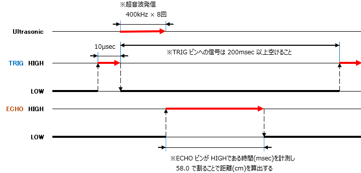
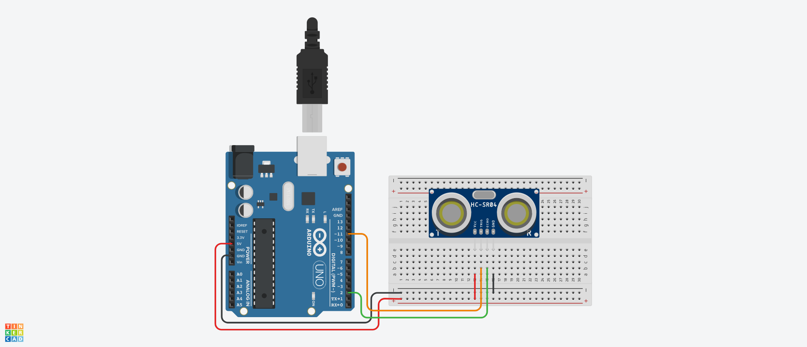

# UltrasonicSensorHCSR04 Class 定義
## Ⅰ.概要
### Ⅰ-ⅰ クラスパラメータ

|Parameter |Value |Note |
|:---|---:|:---|
|namespace |ElectronicComponent |電子部品共通名前空間を使用する |
|template-spec |n/a |テンプレートの指定なし |
|ms-decl-spec |n/a |ストレージ クラスの指定なし |
|tag |UltrasonicSensorHCSR04 | |
|base |n/a |基本クラスの指定なし |

### Ⅰ-ⅱ 処理概要
Arduino 向け超音波距離センサ用クラス定義
1. 超音波距離センサで距離計測ができる
1. 測距タイミングは ECHO からの入力ピンに対する割り込み処理を利用する
1. TRIG および ECHO 動作タイミングは fig1-1 を参照

  
**fig1-1 超音波距離センサ動作タイミングチャート**

## Ⅱ.メンバ定義
### Ⅱ-ⅰ.定数
|No |ID |Access |Type |Value |Abstruct |
|:---:|:---|:---|:---:|---:|:---|
|1 |TIME_DISTANCE_CONV_COEFFICIENT |private |float |58.73715F |時間距離変換用係数 |
|2 |TRIGGER_SIGNAL_TRANSMISSION_TIME |private |unsigned long |10UL |トリガー信号発信時間(μsec) |
|3 |TRIGGER_PROHIBITION_TIME |private |unsigned long |10UL |トリガー信号発信禁止時間(msec) |

> [!TIP]
> 時間距離変換用係数について、音速は 34050(cm/sec) となる(1 atm/15 °C の場合)ため経過時間 $t$ (μsec)から距離 $D$ (cm)を算出する以下式
> $$D = \cfrac{34050}{1000000} \cdot \frac{t}{2}$$  
> より  
> $$D = \cfrac{t}{58.73715}$$  
> が導出されるため、除数として 58.73715F と定義する

### Ⅱ-ⅱ.変数
|No |ID |Access |Type |Abstruct |
|:---:|:---|:---|:---:|:---|
|1 |trigPinNo |Private |unsigned int |TRIG ピン番号 | 
|2 |echoPinNo |Private |unsigned int |ECHO ピン番号 | 
|3 |measurementDistance |Private |float |測定距離 | 
|4 |inspectionTime |Private |unsigned long |測定時間(経過ミリ秒) | 

### Ⅱ-ⅲ.メソッド
|No |ID |Access |Return Type |Abstract |
|:---:|:---|:---|:---:|:---|
|1 |UltrasonicSensorHCSR04 |Public |void |コンストラクタ |
|2 |echoStatusCng |private |void |ECHO 状態変化時処理 |
|3 |emitTrigger |public |void |TRIG 信号発信処理 |
|4 |getDistance |public |float |測定距離取得 |
|5 |getInspectionTime |public |unsigned long |測定時間取得 |

> [!NOTE]
> デストラクタなし  

#### Ⅱ-ⅲ-1.UltrasonicSensorHCSR04()
1. 引数

|No |ID |Type |Value |Optional |Abstract |
|:---:|:---|:---:|---:|:---:|:---|
|1 |trigPin |unsigned int |- |false |ピン番号(TRIG) |
|2 |echoPin |unsigned int |- |false |ピン番号(ECHO) |

2. 処理概要  
* コンストラクタとして呼ばれ、以下のメンバを初期化する

|ID |Value |Note |
|:---|---:|:---|
|trigPinNo |trigPin | |
|echoPinNo |echoPin | |
|measurementDistance |0.0F | |
|inspectionTime |0UL | |

* ECHO ピンへの割り込み時処理を初期化する

#### Ⅱ-ⅲ-2.echoStatusCng()
1. 引数  
なし

2. 処理概要

* ECHO ピンの状態が LOW → HIGH の場合  
  - 測定開始時間に現在のマイクロ秒を格納する 
* ECHO ピンの状態が HIGH → LOW の場合
  - 現在時から測定開始時間を引き、計測時間を取得する
  - 以下の式で計測時間 $t$ から距離 $D$ を算出し、メンバ 測定距離 に格納する  
  $$D = \cfrac{t}{58.73715}$$
  - 現在時(ミリ秒)をメンバ 測定時間 に格納する

#### Ⅱ-ⅲ-3.emitTrigger()
1. 引数  
なし

2. 処理概要

* 前回のトリガー送信から 200ms 超経過している場合、TRIG ピンを TRIGGER_SIGNAL_TRANSMISSION_TIME の間 HIGH にする
* 前回のトリガー送信から 200ms 以内の場合何もしない

#### Ⅱ-ⅲ-4.getDistance()
1. 引数  
なし

2. 処理概要

* メンバ 測定距離 の値を返す

#### Ⅱ-ⅲ-5.getInspectionTime()
1. 引数  
なし

2. 処理概要

* メンバ 測定時間 の値を返す

## Ⅲ.特記事項
### Ⅲ-ⅰ.利用上の注意
このクラスは Arduino での利用を想定しているため、他のマイコンボードでの動作は保証しない

### Ⅲ-ⅱ.利用方法
1. setup() 内でクラスインスタンスを生成する。ECHO ピン番号および TRIG ピン番号を指定すること

```
UltrasonicSensorHCSR04* mySensor;
mySensor = new UltrasonicSensorHCSR04( 9U, 2U );
```
> [!IMPORTANT]
> Aruduno UNO の場合、外部割込みに使用できるピンは D2 もしくは D3 のみであることに注意  

2. loop() 内でメソッド emitTrigger() をコールし、測定を行う

```
mySensor->emitTrigger();
```

3. メソッド getDistance() 、getInspectionTime() をコールし、距離および測定時刻を取得する

```
float dist = mySensor->getInspectionTime();
unsigned long time = mySensor->getInspectionTime();
```

### Ⅲ-ⅲ.サンプルスケッチ
  
**fig3-1 サンプルスケッチ動作用回路**

サンプルスケッチは fig3-1 のように回路を作成すること  
5 秒ごとに距離を測定する  
PC 側のシリアルモニタに測定時間(経過ミリ秒)と距離が表示される(以下例参照)  

```
Ready...
4291 : 1.23cm
9248 : 2.34cm
```
